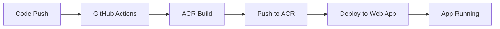

# ZavaStorefront Azure Infrastructure

This directory contains the Azure infrastructure as code (IaC) for the ZavaStorefront application using Bicep and Azure Developer CLI (azd).

## Architecture Overview

```
┌─────────────────────────────────────────────────────────────────────────┐
│                    Resource Group: rg-zavastore-dev-westus3             │
├─────────────────────────────────────────────────────────────────────────┤
│                                                                         │
│  ┌─────────────────┐     ┌──────────────────┐     ┌─────────────────┐  │
│  │  Azure Container │     │   App Service    │     │  Application    │  │
│  │    Registry      │────▶│   (Linux/Docker) │────▶│   Insights      │  │
│  │   (ACR Basic)    │     │     (B1 SKU)     │     │                 │  │
│  └─────────────────┘     └──────────────────┘     └─────────────────┘  │
│          │                        │                        │           │
│          │                        │                        ▼           │
│          │                        │              ┌─────────────────┐   │
│          │                        │              │  Log Analytics  │   │
│          │                        │              │   Workspace     │   │
│          │                        │              └─────────────────┘   │
│          │                        │                                    │
│          │                        │              ┌─────────────────┐   │
│          │                        └─────────────▶│   Azure AI      │   │
│          │                                       │   Services      │   │
│          │                                       │   (GPT-4, Phi)  │   │
│          │                                       └─────────────────┘   │
│          │                                                             │
│          ▼                                                             │
│  ┌─────────────────────────────────────────┐                          │
│  │  Managed Identity (AcrPull Role)         │                          │
│  │  Web App pulls images from ACR securely  │                          │
│  └─────────────────────────────────────────┘                          │
│                                                                         │
└─────────────────────────────────────────────────────────────────────────┘
```

## Resources Provisioned

| Resource | Type | SKU | Purpose |
|----------|------|-----|---------|
| Resource Group | `rg-zavastore-dev-swedencentral` | - | Container for all resources |
| Azure Container Registry | `acrzavastoredev` | Basic | Store Docker images |
| App Service Plan | `asp-zavastore-dev-swedencentral` | B1 Linux | Host web app |
| Web App | `app-zavastore-dev-swedencentral` | Linux Container | Run ZavaStorefront |
| Application Insights | `appi-zavastore-dev-swedencentral` | - | Monitoring/telemetry |
| Log Analytics | `log-zavastore-dev-swedencentral` | PerGB2018 | Log storage |
| Azure AI Services | `ai-zavastore-dev-swedencentral` | S0 | GPT-4o model |

## File Structure

```
infra/
├── main.bicep            # Main orchestration template
├── main.bicepparam       # Parameters file
├── abbreviations.json    # Naming abbreviations reference
└── modules/
    ├── containerRegistry.bicep   # ACR module
    ├── appServicePlan.bicep      # App Service Plan module
    ├── webApp.bicep              # Web App for Containers
    ├── appInsights.bicep         # Application Insights + Log Analytics
    ├── aiFoundry.bicep           # Azure AI Services
    └── roleAssignment.bicep      # AcrPull role assignment
```

## Prerequisites

1. **Azure CLI** - [Install](https://docs.microsoft.com/cli/azure/install-azure-cli)
2. **Azure Developer CLI (azd)** - [Install](https://learn.microsoft.com/azure/developer/azure-developer-cli/install-azd)
3. **Azure Subscription** with sufficient quota for:
   - App Service B1 SKU
   - Azure OpenAI in swedencentral
   - Container Registry Basic SKU

## Quick Start

### Option 1: Using Azure Developer CLI (Recommended)

```bash
# Login to Azure
azd auth login

# Initialize environment
azd init

# Provision infrastructure
azd provision

# Build and deploy application
azd deploy
```

### Option 2: Using Azure CLI with Bicep

```bash
# Login to Azure
az login

# Create deployment at subscription level
az deployment sub create \
  --location westus3 \
  --template-file infra/main.bicep \
  --parameters infra/main.bicepparam
```

### Option 3: Using GitHub Actions

1. Configure GitHub secrets:
   - `AZURE_CLIENT_ID` - Azure AD app client ID
   - `AZURE_TENANT_ID` - Azure AD tenant ID
   - `AZURE_SUBSCRIPTION_ID` - Azure subscription ID

2. Run the "Provision Infrastructure" workflow manually

## Building Container Images (No Local Docker Required)

The infrastructure is designed for cloud-side builds using ACR Build:

```bash
# Build and push using ACR Build
az acr build \
  --registry acrzavastoredev \
  --image zavastore:latest \
  --file src/Dockerfile \
  ./src
```

## Deployment Workflow



## Security Features

- **Managed Identity**: Web App uses system-assigned managed identity
- **No Password Secrets**: ACR pull uses RBAC (AcrPull role), not admin password
- **HTTPS Only**: Web App configured for HTTPS-only traffic
- **TLS 1.2**: Minimum TLS version enforced

## Estimated Monthly Costs (Dev Environment)

| Resource | SKU | Est. Cost/Month |
|----------|-----|-----------------|
| ACR Basic | Basic | ~$5 |
| App Service Plan | B1 | ~$13 |
| App Insights | Free tier (5GB/mo) | ~$0 |
| Log Analytics | PerGB2018 | ~$2-5 |
| Azure AI (Foundry) | S0 + usage | ~$0 base + token usage |
| **Total** | | **~$20-25/month** |

## Environment Variables

The following environment variables are automatically configured in the Web App:

| Variable | Description |
|----------|-------------|
| `APPLICATIONINSIGHTS_CONNECTION_STRING` | App Insights connection string |
| `DOCKER_REGISTRY_SERVER_URL` | ACR login server URL |
| `AI_ENDPOINT` | Azure AI Services endpoint |

## Customization

### Changing SKUs

Edit `infra/main.bicepparam`:

```bicep
param appServiceSkuName = 'B2'  // Upgrade to B2
param acrSku = 'Standard'       // Upgrade ACR
```

### Adding New Environments

1. Create new parameter file: `main.staging.bicepparam`
2. Update `environmentName` parameter to `'staging'`
3. Deploy with: `az deployment sub create --parameters infra/main.staging.bicepparam`

## Troubleshooting

### Common Issues

1. **ACR Pull Failures**
   - Verify managed identity is enabled on Web App
   - Check AcrPull role assignment exists
   - Confirm image exists in ACR

2. **AI Model Quota Errors**
   - Check westus3 quota for Azure OpenAI
   - Request quota increase if needed

3. **Web App Not Starting**
   - Check App Service logs in Log Analytics
   - Verify Dockerfile exposes port 80

## Related Documentation

- [Azure Developer CLI](https://learn.microsoft.com/azure/developer/azure-developer-cli/)
- [Bicep Documentation](https://learn.microsoft.com/azure/azure-resource-manager/bicep/)
- [ACR Build Tasks](https://learn.microsoft.com/azure/container-registry/container-registry-tasks-overview)
- [App Service Containers](https://learn.microsoft.com/azure/app-service/configure-custom-container)
